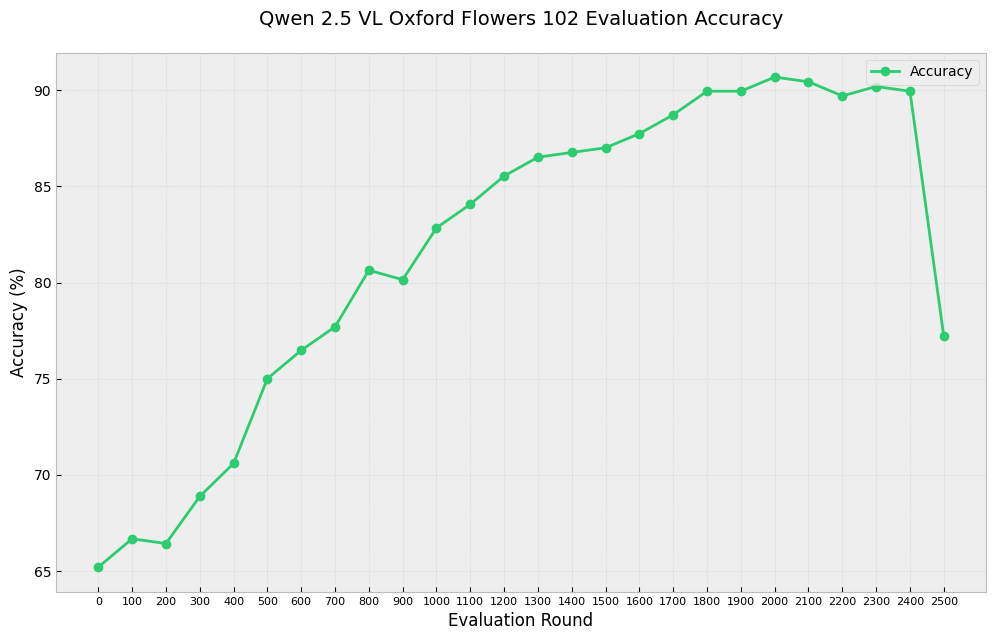

# DeepSeek R1 Implementation (Extended for VLMs)

## Motivation
I wanted to recreate DeepSeek R1's results at a smaller scale, focusing on understanding the core mechanics by implementing everything from scratch. This repository initially focused on training Qwen1.5B on the [grade school math dataset](https://github.com/openai/grade-school-math) (GSM8K). **It has now been extended to support Vision-Language Models (VLMs), demonstrated with Qwen-VL on the Flowers-102 image classification task.**

This implementation heavily borrows from [Will Brown's work](https://gist.github.com/willccbb/4676755236bb08cab5f4e54a0475d6fb) ([@willccbb](https://x.com/willccbb)), but restructures the code into a format optimized for learning and experimentation.

The key difference in my implementation is computing the GRPO loss function directly rather than using external RL libraries, and reformatting into a multi-script repo.

I hope this might help other people understand things better, and maybe provide an easier way to try out smaller scale ideas etc.

## Installation
```
pip install -r requirements.txt
```

Required environment variables:
```
export HUGGINGFACE_TOKEN="your-token-here"
huggingface-cli login
```

## Implementation Details

The system consists of several key modules:

### main.py
Contains the core training loop implementing GRPO (Generalized Reward-Powered Optimization). Handles model training, evaluation, and metric tracking for both text-only and VLM tasks.

### llms.py
Manages model loading and configuration, supporting Qwen models (including Qwen-VL) through Hugging Face's transformers library. Designed to be easily extensible.

### rldatasets.py
Handles dataset loading and preprocessing. Supports GSM8K math problems and the Flowers-102 image classification dataset (using `torchvision`). Implements custom data loaders for training and evaluation.

### evaluator.py
Contains evaluation metrics and reward functions. Includes specific evaluators for GSM8K (`GSM8kEvaluator`) and Flowers-102 (`FlowerEvaluator`), defining task-specific reward components.

### utils.py
Contains helper functions for seeding, logging, probability calculations (copied from TRL), PDF generation for evaluation reports, and vision processing utilities (`qwen_vl_utils.py` is also used for VLM specifics).

### plotter.py
Generates plots from training and evaluation logs saved during runs, including training metrics and evaluation accuracy/rewards over time.

## Running Experiments

### GSM8K (Text-Only)
```bash
python main.py \
    --model Qwen/Qwen1.5-1.8B-Chat \
    --dataset gsm8k \
    --output_dir ./gsm8k_output \
    # Add other parameters like batch_size, learning_rate etc.
```

### Flowers-102 (Vision-Language)
The goal for this task is image classification where the model must provide reasoning steps in XML format (`<reasoning>...</reasoning><answer>This flower is a [type]</answer>`) along with the prediction. The reward combines correctness (2.0 points) and reasoning quality (up to 1.0 point based on length and keywords like 'petal', 'color', 'shape').

```bash
python main.py \
    --model Qwen/Qwen-VL-Chat \
    --dataset flowers \
    --output_dir ./qwen_vl_flowers_output \
    --batch_size 4 \
    --learning_rate 1e-6 \
    --kl_coeff 0.1 \
    --num_epochs 3 \
    --eval_interval 50 \
    --log_interval 10
    # Adjust parameters as needed
```
*   The Flowers-102 dataset is automatically downloaded via `torchvision`.
*   Evaluation results (PDF reports, JSON metrics) are saved in the `output_dir`.
*   After training, generate plots: `python plotter.py --output_dir ./qwen_vl_flowers_output`

## Results

### GSM8K
Training was conducted on a single H100 GPU. After ~400 training steps:


And results on the validation set - this shows a clearer sign of learning:


### Flowers-102 (Qwen-VL)
Training Qwen-VL on Flowers-102 showed significant improvement in classification accuracy on the test set:



The plot above shows the evaluation accuracy on the Flowers-102 test set across training rounds. Accuracy improved from approximately 65% to 90%. Rewards were based on classification correctness and the quality of the reasoning provided (presence of relevant visual terms).

## Extending to New Datasets
To add support for a new dataset (text-only or VLM):

1.  **Dataset Handling:** Create a new dataset class in `rldatasets.py` (e.g., `MyDataset`) inheriting from `torch.utils.data.Dataset`. Implement `__len__` and `__getitem__` to return processed prompts and answers suitable for the model. For VLMs, ensure image paths or pre-processed image data are included.
2.  **Reward Evaluation:** Implement a new `RewardEvaluator` subclass in `evaluator.py` (e.g., `MyEvaluator`). Define task-specific reward functions (like `_correctness_reward`, `_reasoning_reward`, etc.) within this class. Implement `compute_rewards` to calculate these scores and `get_reward_breakdown` to label them.
3.  **Integration:**
    *   Update the `get_dataset` function in `rldatasets.py` to recognize your new dataset name (e.g., `'mydataset'`) and return an instance of `MyDataset`.
    *   Update the `get_evaluator` function in `evaluator.py` to recognize your dataset name and return an instance of `MyEvaluator`.
4.  **Running:** Use the `--dataset mydataset` argument when running `main.py`. Adjust other arguments like `--model`, reward weights in the evaluator, etc., as needed for your task.

## Future Vision: Interpretable Scientific Classification
I believe this approach, combining RL fine-tuning with structured reasoning output, holds significant promise for scientific image classification. It allows scientists not only to get accurate predictions but also to inspect the model's reasoning process, allowing for more trust and understanding. Also, the ability to shape rewards using natural language descriptions or by directly editing/writing Chain-of-Thought examples offers an intuitive and powerful way for domain experts to guide model training without deep ML expertise.

## Future Directions (Original + VLM)
Building on this:

1.  Adding self-play capabilities for more dynamic reward signals.
2.  Implementing soft reward structures, particularly for complex reasoning.
3.  Expanding VLM capabilities and exploring how R1-style training enhances world modeling.
4.  Improving speed and adding multi-GPU support.


## Citation
If you use this work, please cite:
```bibtex
@misc{hogan2024deepseek_rl_extended,
  author = {Hogan, Brendan},
  title = {DeepSeekRL-Extended},
  year = {2024},
  publisher = {GitHub},
  journal = {GitHub repository},
  url = {https://github.com/brendanhogan/DeepSeekRL-Extended} 
}
```


