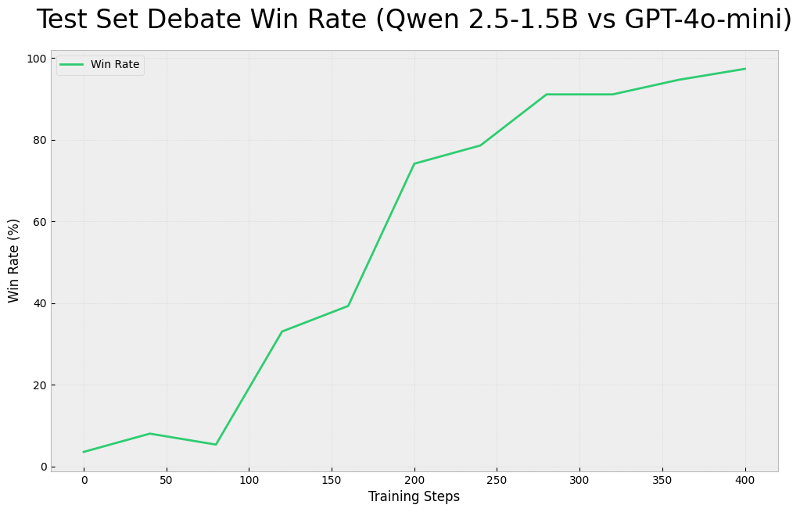

# GRPO for Soft Reward Training

## Overview
This repository implements Generalized Reward-Powered Optimization (GRPO) for training language models using soft rewards and LLM-generated feedback. The framework is designed to be general-purpose for various applications, with the debate framework serving as the first implementation. Future implementations will include recipe generation and comedy writing.

## Key Features
- **Soft Reward Framework**: Instead of binary correct/incorrect rewards, uses relative performance metrics between model responses
- **Round-Robin Tournament**: During training, models compete against each other in a round-robin tournament to establish relative performance
- **Win Rate Evaluation**: During testing, models compete head-to-head against a base model to measure absolute performance
- **Flexible Model Interface**: Supports both Hugging Face models and external API models (OpenAI, Anthropic) for judge and comparison models
- **Structured Output Format**: Uses XML tags to enforce structured reasoning and argumentation

## How It Works

### Training Process
1. For each debate topic:
   - Generate multiple responses from the training model
   - Conduct round-robin tournament between responses
   - Compute relative rewards based on win/loss record
   - Apply GRPO loss to improve model performance

### Evaluation Process
1. For each test topic:
   - Generate responses from both training model and base model
   - Have judge model evaluate head-to-head debates
   - Track win rate against base model
   - Measure format adherence and reasoning quality

### Reward Structure
The total reward consists of:
1. **Debate Performance**: Relative performance in round-robin tournament (training) or win rate against base model (testing)
2. **Format Adherence**: Rewards for proper XML structure and reasoning format
3. **Reasoning Quality**: Rewards for logical coherence and argument strength

## Installation
```
pip install -r requirements.txt
```

Required environment variables:
```
export HUGGINGFACE_TOKEN="your-token-here"
export OPENAI_API_KEY="your-key-here"  # If using OpenAI models
export ANTHROPIC_API_KEY="your-key-here"  # If using Anthropic models
```

## Usage
```bash
python main.py \
    --model_name "Qwen/Qwen2.5-1.5B-Instruct" \
    --judge_model_name "gpt-4o" \
    --compare_model_name "gpt-4o-mini" \
    --dataset_name "debate" \
    --output_dir "output"
```

## Implementation Details

### Model Interface
The `model_interface.py` provides a unified interface for different model types:
- `HuggingFaceModel`: For local Hugging Face models
- `OpenAIModel`: For OpenAI API models
- `AnthropicModel`: For Anthropic API models

### Reward Computation
The `evaluator.py` module handles:
- Round-robin tournament scoring during training
- Head-to-head evaluation during testing
- Format and reasoning quality metrics

### Dataset Structure
The debate dataset provides topics and positions (PRO/CON) for training and evaluation. Each response must follow the format:
```
<reasoning>
Step-by-step reasoning process
</reasoning>
<answer>
Final debate position
</answer>
```

## Results

### Debate Framework Results
The debate framework demonstrates the effectiveness of GRPO training:


*Win rate of Qwen 2.5-1.5B vs GPT-4o-mini throughout training, showing improvement from 3% to >95% win rate*

1. **Base Model vs GPT-4o Performance**:
   - Initial performance: 3% win rate
   - Final performance: >95% win rate
   - Shows significant improvement in debate capabilities

2. **Cross-Model Generalization**:
   - Initial model performance: 30% win rate
   - Fine-tuned model performance: >95% win rate
   - Results achieved with a different judge (GPT-4o) than training
   - Demonstrates robust improvement beyond reward hacking

### Comedy Framework Results
The comedy framework demonstrates GRPO's versatility in training models for creative tasks:


*Win rate of Qwen 2.5-7B vs GPT-4o-mini in Larry David-style comedy throughout training*

1. **Base Model vs GPT-4o Performance**:
   - Initial performance: 15% win rate
   - Final performance: >90% win rate


## Future Directions
1. Expand to more complex debate scenarios
2. Implement multi-round debates
3. Add support for more model types
4. Improve reward structure and evaluation metrics
5. Add panel of judges/multiobjective - generically - and setting of simulating populations 

## Citation
If you use this framework in your research, please cite it as:

```
@misc{hogan2024debate,
  author = {Hogan, Brendan},
  title = {Debate Framework for Language Model Training},
  year = {2024},
  publisher = {GitHub},
  url = {https://github.com/brendanhogan/debate-framework}
}
```
